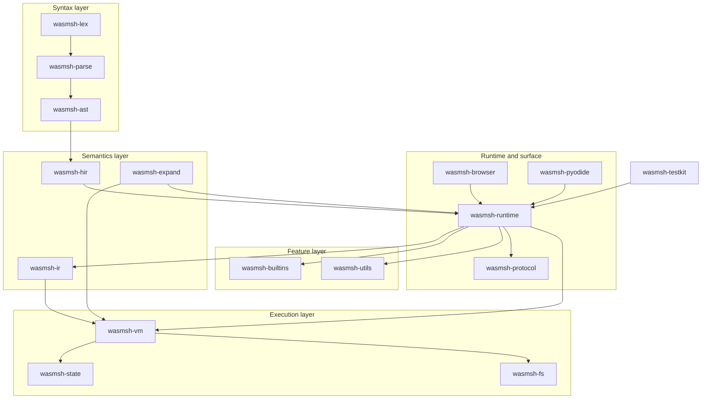
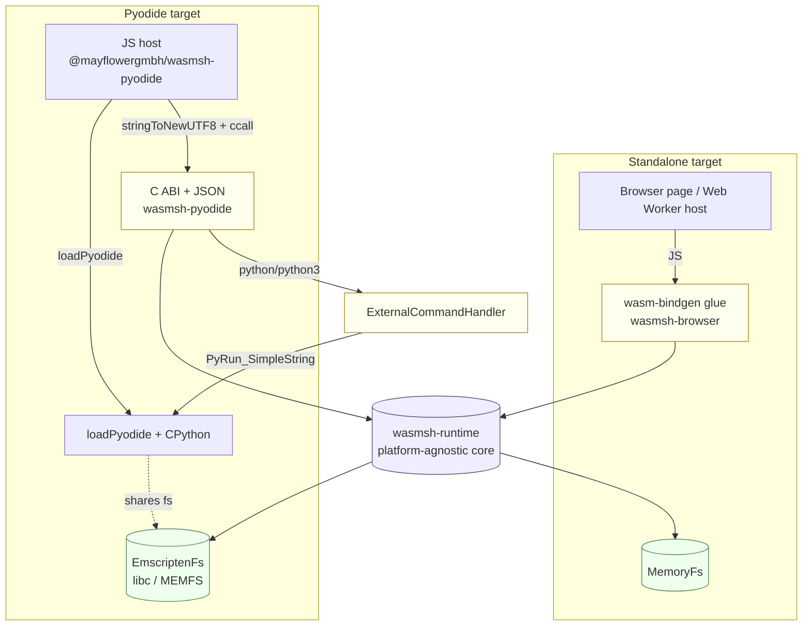

# Architecture

How wasmsh is structured and why.

## Pipeline Overview

```mermaid
flowchart LR
    src[Source text]:::input
    lex[Lexer<br/>wasmsh-lex]:::core
    parse[Parser<br/>wasmsh-parse]:::core
    ast[AST<br/>wasmsh-ast]:::core
    hir[HIR<br/>wasmsh-hir]:::core
    runtime[Executor gate + interpreter<br/>wasmsh-runtime]:::runtime
    ir[Subset IR<br/>wasmsh-ir]:::core
    vm[Subset VM<br/>wasmsh-vm]:::core
    dispatch[Dispatch + I/O routing<br/>wasmsh-runtime]:::runtime
    fs[(BackendFs)]:::fs
    out[WorkerEvent stream<br/>wasmsh-protocol]:::output

    src --> lex --> parse --> ast --> hir --> runtime
    runtime -->|supported subset| ir --> vm --> dispatch
    runtime -->|fallback path| dispatch
    dispatch -.reads/writes.-> fs
    dispatch --> out

    classDef input fill:#eef,stroke:#557
    classDef core fill:#fff,stroke:#999
    classDef runtime fill:#ffe,stroke:#a82
    classDef fs fill:#efe,stroke:#585
    classDef output fill:#fee,stroke:#a55
```



Parsing always reaches HIR first. After that, `wasmsh-runtime` decides
whether a top-level `and/or` list can use the bounded IR/VM subset. If it
cannot, the runtime interprets HIR directly. Expansion, redirection
planning, command resolution, budgeting, and protocol emission stay in the
runtime layer in both cases.

The platform-agnostic core lives in `wasmsh-runtime`. Two thin adapters wrap
it: `wasmsh-browser` for the standalone `wasm32-unknown-unknown` target, and
`wasmsh-pyodide` for the Pyodide / Emscripten target. See the
[Dual-Target Architecture](#dual-target-architecture) section below.

## Crate Map



The testkit depends on `wasmsh-runtime` directly (no browser dep) so that
TOML conformance tests run on native Rust without any wasm build. The two
adapter crates (`wasmsh-browser` and `wasmsh-pyodide`) are the only crates
that depend on target-specific toolchains.

```
wasmsh-ast          AST types: Word, WordPart, Command, Redirection, etc.
wasmsh-lex          Stateful lexer with quoting modes
wasmsh-parse        Recursive-descent parser + word parser
wasmsh-expand       Expansion engine (params, arithmetic, glob, brace, tilde)
wasmsh-hir          High-level IR: normalizes AST into Exec/Assign/RedirectOnly
wasmsh-ir           Linear IR for the currently supported VM subset (assign, builtin exec,
                    redirection plan, short-circuit jumps)
wasmsh-vm           Cooperative VM and shared budget/diagnostic primitives for the subset path
wasmsh-state        Shell state: variables (scalar/array/assoc), scopes, positional params, cwd
wasmsh-builtins     23 registered builtins (echo, test, [, cd, export, trap, eval, printf, read, ...)
wasmsh-utils        88 utilities (cat, grep, sed, sort, find, jq, awk, yq, bc, rg, fd,
                    diff, patch, tree, tar, gzip, unzip, xxd, dd, strings, md5sum,
                    sha*sum, curl, wget, ...)
wasmsh-fs           VFS abstraction: MemoryFs, EmscriptenFs (feature-gated), OpfsFs (stub),
                    path normalization. `BackendFs` type alias resolves to one of them.
wasmsh-runtime      WorkerRuntime: end-to-end pipeline, command dispatch, VFS ownership.
                    Platform-agnostic — used by both targets.
wasmsh-browser      Thin wasm-bindgen wrapper around WorkerRuntime, exposing the
                    `WasmShell` JS API for the standalone Web Worker target.
wasmsh-protocol     Host↔Worker message types (HostCommand, WorkerEvent, DiagnosticLevel)
wasmsh-testkit      TOML test runner, feature gates, oracle comparison

# Excluded from the default workspace (require emcc):
wasmsh-pyodide          C ABI + JSON protocol bridge for the Pyodide build target
wasmsh-pyodide-probe    Emscripten staticlib probe used by build-contract tests
```

The Pyodide-only crates live alongside the others under `crates/` but are
excluded from the workspace `members` list so that a standard `cargo build`
does not require Emscripten.

## Key Design Decisions

### No Parser Generators

The lexer and parser are handwritten. This gives full control over:
- Context-sensitive reserved word handling
- Here-document deferred body resolution
- Error recovery and diagnostic quality
- No GPL-licensed grammar files

See [ADR-0003](../adr/ADR-0003-handwritten-parser.md).

### Structured Word Model

Words are not flattened to strings during parsing. `WordPart` preserves:
- Literal text vs quoted regions
- Expansion boundaries (`$var`, `${...}`, `$(...)`, `$((...))`)
- Quoting context (single, double, ANSI-C)

This enables correct multi-phase expansion without re-parsing.

See [ADR-0004](../adr/ADR-0004-word-ast-and-expansion-phases.md).

### No OS Processes

In the browser, there are no processes, pipes, or signals. wasmsh models everything in-process:

- **Builtins** modify shell state directly
- **Utilities** operate on the VFS through the same API
- **Functions** share the parent scope (bash behavior)
- **Pipelines** use `PipeBuffer` — buffered data flow between stages
- **Subshells** get isolated variable scope via `push_scope/pop_scope`

See [ADR-0002](../adr/ADR-0002-browser-first-wasm-target.md).

### Cooperative Execution

Execution is cooperative, not preemptive:
- Step budget limits per execution
- Cancellation tokens checked at predictable boundaries
- Output byte tracking
- Resumable `StartRun` / `PollRun` protocol support
- No infinite loops in the browser's event loop

See [ADR-0009](../adr/ADR-0009-budgets-cancellation.md).

### Clean-Room Implementation

No code is copied from Bash, BusyBox, or their test suites. Compatibility is a behavioral goal achieved through:
- POSIX specification reading
- Black-box comparison against reference shells
- Original test cases

See [ADR-0001](../adr/ADR-0001-clean-room-boundary.md).

### Arrays and Variable Types

Variables support three value types via `VarValue` enum:
- `Scalar(SmolStr)` — default string values
- `IndexedArray(IndexMap<usize, SmolStr>)` — `arr=(a b c)`, sparse indexing
- `AssocArray(IndexMap<SmolStr, SmolStr>)` — `declare -A map`

Variable attributes: `exported`, `readonly`, `integer` (auto-arithmetic), `nameref` (indirect reference).

### Full Arithmetic Engine

The arithmetic evaluator (`eval_arithmetic`) is a proper recursive-descent parser supporting all bash arithmetic operators with correct precedence: assignment, ternary, logical, bitwise, comparison, shift, arithmetic, exponentiation, unary, and postfix. Supports hex (`0xFF`), octal (`077`), binary (`0b1010`), and arbitrary base (`N#digits`) literals.

### Extended Test `[[ ]]`

`[[ ]]` is a full compound command with its own evaluation engine:
- Glob pattern matching on `==`/`!=` RHS
- Regex matching with `=~` and `BASH_REMATCH` capture groups
- String ordering with `<`/`>`
- No word splitting or globbing on variables
- `&&`/`||`/`!` logical operators with grouping

### Extended Globbing

When `extglob` is enabled (default): `?(pat)`, `*(pat)`, `+(pat)`, `@(pat)`, `!(pat)`. Implemented via recursive backtracking matcher. `globstar` enables `**` recursive directory traversal.

### Dynamic Variables

Several variables are evaluated on read rather than storing a fixed value in `ShellState`:
- `$RANDOM` — 16-bit value from an XorShift PRNG seeded at shell init; writable to reseed the generator
- `$LINENO` — current source line, tracked by the VM from span information
- `$SECONDS` — elapsed seconds since shell initialisation; writable to reset the origin
- `$PIPESTATUS` — indexed array of exit codes from the most recent pipeline
- `$FUNCNAME` / `$BASH_SOURCE` — call-stack arrays updated by the function call frame machinery

### Alias Expansion

Alias lookup and recursive expansion occurs in `wasmsh-runtime` after word
preparation and before builtin/utility/function resolution. The `alias`
and `unalias` builtins manage the alias table stored in `ShellState`.
Alias expansion is suppressed for commands that are themselves alias
definitions and for quoted command names, matching bash behaviour.

## Execution Flow

```mermaid
sequenceDiagram
    participant Host
    participant Runtime as WorkerRuntime
    participant Parse as parse + HIR lower
    participant Gate as subset gate
    participant VM
    participant Dispatch as execute + dispatch
    participant FS as BackendFs

    Host->>Runtime: HostCommand::Run { input }
    Runtime->>Parse: parse(input) → HIR
    Parse-->>Runtime: HIR program
    loop per top-level and/or list
        Runtime->>Gate: validate subset
        alt supported VM subset
            Gate->>Runtime: lower to IR
            Runtime->>VM: run subset program
            VM->>Dispatch: execute builtin / assignment hooks
        else fallback interpreter
            Gate->>Dispatch: interpret HIR directly
        end
        alt runtime command (declare, let, shopt, alias, ...)
            Dispatch->>Dispatch: runtime intercept
        else shell function
            Dispatch->>Dispatch: execute function body
        else builtin
            Dispatch->>Dispatch: BuiltinRegistry.call
        else utility
            Dispatch->>FS: read/write
            Dispatch->>Dispatch: UtilRegistry.call
        else external handler
            Dispatch->>Host: ExternalCommandHandler<br/>(e.g. python in Pyodide)
        end
    end
    Dispatch-->>Runtime: stdout/stderr + status + fs changes
    Runtime-->>Host: Vec&lt;WorkerEvent&gt;<br/>(Stdout, Stderr, Diagnostic, Exit)
```

When `WorkerRuntime::handle_command(HostCommand::Run { input })` is invoked
(implementation in `wasmsh-runtime/src/lib.rs`):

1. **Parse**: `wasmsh_parse::parse(input)` → `Program` AST
2. **Lower**: `wasmsh_hir::lower(&ast)` → `HirProgram`
3. **Update `$LINENO`** from span position
4. **For each top-level `and/or` list**:
   a. Try the VM subset gate
   b. If supported, lower to `IrProgram` and run it through `Vm`
   c. Otherwise interpret the HIR path directly
5. **For each simple command on either path**:
   a. Resolve command substitutions (`$(...)`) by recursive execution
   b. Expand words (parameter, arithmetic, tilde, case modification, indirect)
   c. Check `nounset` (`set -u`) for unbound variables
   d. Apply brace expansion and glob expansion when the command shape needs them
   e. Plan command-local stdin/stdout/stderr with the fd table / pre-exec I/O model
   f. Expand aliases before dispatch
   g. Dispatch: runtime-level command → builtin → shell function → utility →
      external command handler
6. **Collect events**: stdout, stderr, diagnostics, fs changes → `Vec<WorkerEvent>`
7. **Set `$PIPESTATUS`** after pipeline execution
8. **Fire traps**: EXIT trap if exit was requested

## Dual-Target Architecture



The key insight: `wasmsh-runtime` never knows whether it is running alongside
a Python interpreter. It exposes two seams — the `BackendFs` type alias and
the `ExternalCommandHandler` callback — and each adapter populates those
seams differently. In the Pyodide build the VFS is shared because both
wasmsh and CPython call the same libc, and `python` commands are dispatched
back into the same Emscripten module.

`wasmsh-runtime` is platform-agnostic. The two targets differ only in the
adapter that owns it and the `BackendFs` it sees:

| Aspect              | Standalone (`wasmsh-browser`)         | Pyodide (`wasmsh-pyodide`)            |
|---------------------|---------------------------------------|---------------------------------------|
| Target triple       | `wasm32-unknown-unknown`              | `wasm32-unknown-emscripten`           |
| Host bridge         | `wasm-bindgen` JS API (`WasmShell`)   | C ABI + JSON protocol                 |
| `BackendFs`         | `MemoryFs` (in-memory VFS)            | `EmscriptenFs` (libc → Emscripten FS) |
| Filesystem sharing  | Isolated to wasmsh                    | Shared with the Python interpreter    |
| External commands   | None                                  | `python` / `python3` via `PyRun_SimpleString` |
| Networking          | `fetch` from the host page (gated)    | Routed through the Pyodide host (`pip install` → `micropip`) |
| Boot                | `wasm-pack` bundle in a Web Worker    | `loadPyodide()` in Node or browser    |

The runtime accepts an optional `ExternalCommandHandler` callback. The
Pyodide adapter installs one to dispatch `python`/`python3` to the
in-process interpreter; the browser adapter leaves it unset.

The `BackendFs` swap is feature-gated: `wasmsh-runtime/emscripten` forwards
to `wasmsh-fs/emscripten`, which switches the type alias from `MemoryFs` to
`EmscriptenFs`. This avoids making `WorkerRuntime` generic over the FS type.

See ADR-0017 (shared runtime extraction), ADR-0018 (Pyodide same-module
architecture), ADR-0019 (dual-target packaging), and ADR-0021 (network
capability model) for the full rationale.
