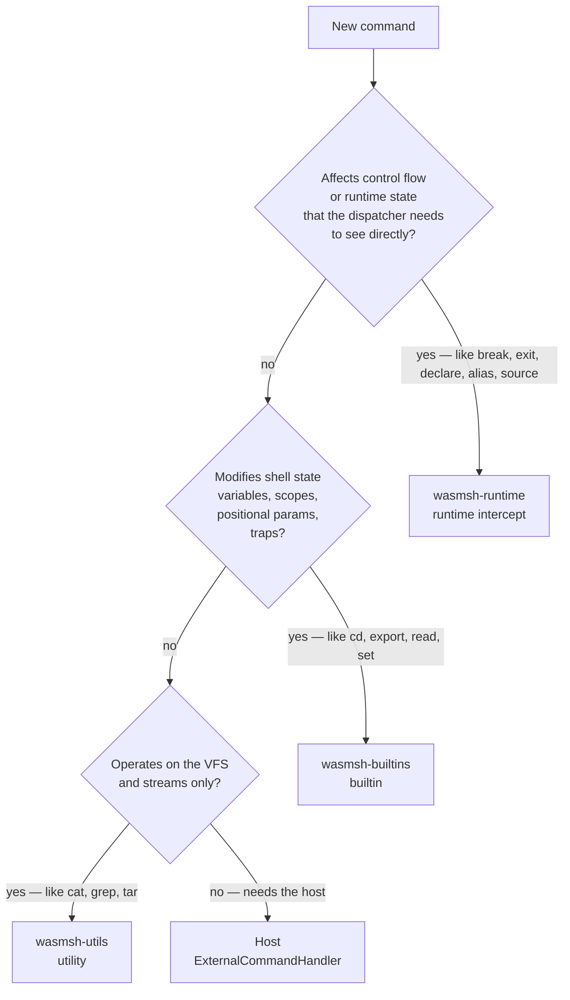

# Adding a Command

How to add a new command to wasmsh. There are three places a command can
live; this guide helps you pick the right one and walks you through each.

## Decide where it goes



| Layer                 | Used for                                                  | Example                |
|-----------------------|-----------------------------------------------------------|------------------------|
| Runtime intercept     | Control flow, state mutators the dispatcher must see     | `declare`, `let`, `shopt`, `alias`, `source`, `mapfile`, `builtin` |
| Builtin               | State mutators that fit a normal call signature          | `cd`, `read`, `export`, `printf`, `test`, `getopts` |
| Utility               | Stateless transforms over the VFS / streams              | `cat`, `grep`, `awk`, `tar`, `jq` |
| External handler      | Things that have to call back into the host              | `python` in the Pyodide build |

If you are adding a coreutils-like text or file processor, you almost
certainly want a **utility**. If you are adding something that touches
shell state, you want a **builtin**. If you are adding something that
needs to be intercepted *before* normal dispatch (control flow,
declarations, aliases), you want a **runtime intercept**.

## Recipe 1: Add a utility

Utilities are the most common case and the simplest. They live in
`wasmsh-utils`, organised by source module under
`crates/wasmsh-utils/src/*_ops.rs`:

| Module             | What goes here |
|--------------------|----------------|
| `file_ops.rs`      | File and directory primitives (cat, ls, cp, find, mktemp, ...) |
| `text_ops.rs`      | Line-oriented text utilities (grep, sed, sort, head, tail, ...) |
| `data_ops.rs`      | Data conversions (seq, expr, base64, md5sum, ...) |
| `system_ops.rs`    | Virtual system commands (env, uname, id, ...) |
| `binary_ops.rs`    | Binary tools (xxd, dd, strings, file, split) |
| `archive_ops.rs`   | Archive formats (tar, gzip, unzip, ...) |
| `hash_ops.rs`      | Hashing (sha1sum, sha512sum) |
| `search_ops.rs`    | Modern search (rg, fd) |
| `awk_ops.rs`       | awk |
| `jq_ops.rs`        | jq |
| `yaml_ops.rs`      | yq |
| `math_ops.rs`      | bc |
| `tree_ops.rs`      | tree |
| `diff_ops.rs`      | diff, patch |
| `disk_ops.rs`      | du, df |
| `net_ops.rs`       | curl, wget |
| `trivial_ops.rs`   | Small POSIX coreutils that don't justify their own module |

Pick the module that matches the command's category. If nothing fits,
create a new `*_ops.rs` module rather than putting it in `trivial_ops`.

### Step 1.1: Write the function

In your chosen module, add a function with the `UtilFn` signature:

```rust
pub(crate) fn util_myutil(ctx: &mut UtilContext<'_>, argv: &[&str]) -> i32 {
    // argv[0] is the command name.
    let args = &argv[1..];

    // No-arg case: try stdin.
    if args.is_empty() {
        if let Some(data) = ctx.stdin {
            ctx.output.stdout(data);
            return 0;
        }
        ctx.output.stderr(b"myutil: missing operand\n");
        return 1;
    }

    // File-arg case: read each file via the VFS.
    for arg in args {
        let full = helpers::resolve_path(ctx.cwd, arg);
        match helpers::read_text(ctx.fs, &full) {
            Ok(text) => ctx.output.stdout(text.as_bytes()),
            Err(e) => {
                ctx.output.stderr(format!("myutil: {arg}: {e}\n").as_bytes());
                return 1;
            }
        }
    }
    0
}
```

`UtilContext` provides:

- `ctx.fs` — the `BackendFs` for file operations.
- `ctx.cwd` — current working directory (resolve relative paths against this).
- `ctx.output` — `OutputSink` with `stdout(bytes)` and `stderr(bytes)`.
- `ctx.stdin` — `Option<&[u8]>` for piped or here-doc input.
- `ctx.state` — `Option<&ShellState>` for environment variable access.

Helpers live in `crates/wasmsh-utils/src/helpers.rs`:

| Helper                                  | Purpose |
|-----------------------------------------|---------|
| `helpers::resolve_path(cwd, path)`      | Resolve a relative path against `ctx.cwd`. |
| `helpers::read_text(fs, path)`          | Read a file as a UTF-8 string. |
| `helpers::get_input_text(ctx, args)`    | Read from files (if any) or fall back to `ctx.stdin`. |
| `helpers::simple_glob_match(pat, name)` | Glob matching for find-like utilities. |
| `helpers::grep_matches(line, pat, ic)`  | Pattern matching with `^`/`$` anchors. |

### Step 1.2: Register the utility

In `crates/wasmsh-utils/src/lib.rs`, in the `UtilRegistry::new()` impl,
add it next to the related entries:

```rust
utils.insert("myutil", file_ops::util_myutil);
```

### Step 1.3: Add the feature gate

In `crates/wasmsh-testkit/src/features.rs`:

```rust
f.insert("myutil");
```

### Step 1.4: Write a TOML test

Tests live under `tests/suite/{category}/`. For a new utility, the
`utilities/` and `utilities_gaps/` folders are the usual targets:

```toml
[test]
name = "myutil-basic"
tags = ["utility", "myutil"]
requires = ["myutil"]

[setup]
files = { "/data/in.txt" = "alpha\nbeta\ngamma\n" }

[input]
script = "myutil /data/in.txt"

[expect]
status = 0
stdout = "alpha\nbeta\ngamma\n"
```

Run it:

```bash
cargo test -p wasmsh-testkit --test suite_runner -- myutil
```

Add at least one stdin test, one error-path test, and one pipeline test
(see [Writing shell tests](../tutorials/writing-tests.md)).

## Recipe 2: Add a builtin

Builtins live in `crates/wasmsh-builtins/src/lib.rs`. Use this layer when
the command needs to mutate `ShellState` (variables, positional params,
exit status, traps) but doesn't need to be intercepted before dispatch.

### Step 2.1: Write the function

```rust
fn builtin_mybuiltin(ctx: &mut BuiltinContext<'_>, argv: &[&str]) -> i32 {
    let args = &argv[1..];
    if args.is_empty() {
        ctx.output.stderr(b"mybuiltin: missing operand\n");
        return 2;   // 2 = misuse, matches bash convention
    }

    // Mutate state directly
    ctx.state.set_var(args[0].into(), "modified".into());

    ctx.output.stdout(b"ok\n");
    0
}
```

`BuiltinContext` is a superset of `UtilContext`:

- `ctx.state` — `&mut ShellState` (mutable, unlike utilities).
- `ctx.output` — `OutputSink`.
- `ctx.fs` — `Option<&BackendFs>` (some builtins like `test -f` use it).
- `ctx.stdin` — pipe / here-doc input.

### Step 2.2: Register and gate

In `BuiltinRegistry::new()`:

```rust
builtins.insert("mybuiltin", builtin_mybuiltin);
```

Add the feature gate in `wasmsh-testkit/src/features.rs` exactly as for
utilities.

### Step 2.3: Test

Same TOML format as utilities. Tests for builtins go under
`tests/suite/builtins/`.

## Recipe 3: Add a runtime intercept

Use this when the command needs special dispatch handling — for example,
it must run before alias expansion, before glob expansion, or it changes
control flow in a way that the dispatcher itself has to honour.

The intercept lives in `crates/wasmsh-runtime/src/lib.rs`. The pattern is:

1. Add a constant for the command name near the other `CMD_*` constants
   (around line 24):

   ```rust
   const CMD_MYCMD: &str = "mycmd";
   ```

2. Find the dispatch site in `WorkerRuntime::dispatch_command` (or its
   helpers) and add a branch *before* the normal builtin/utility lookup:

   ```rust
   if cmd_name == CMD_MYCMD {
       return self.handle_mycmd(args, redirs);
   }
   ```

3. Implement `handle_mycmd` as a method on `WorkerRuntime`. Return the
   same shape as the other intercepts (typically `(i32, Vec<u8>, Vec<u8>)`
   for exit code + stdout + stderr, or whatever the surrounding helpers
   use).

4. Add the feature gate and a TOML test under `tests/suite/runtime/`.

Look at how `handle_declare`, `handle_let`, and `handle_alias` are
implemented in `wasmsh-runtime/src/lib.rs` for working examples.

## Common conventions

### Flag parsing

Walk `argv[1..]` manually. Use `--` to terminate flags. Look at
`util_grep`, `util_sed`, or `util_base64` for working examples.

There is currently no shared flag-parsing helper. If your command has
many flags, encapsulate them in a small struct populated by a single
pass over `argv`.

### Error messages

Match bash conventions: `cmd: arg: message`. Example:

```rust
ctx.output.stderr(format!("myutil: {path}: No such file or directory\n").as_bytes());
```

Always include a trailing newline. Always write to stderr, not stdout.

### Exit codes

| Code     | Meaning                            |
|----------|------------------------------------|
| `0`      | Success                            |
| `1`      | Generic failure                    |
| `2`      | Misuse of the command (bad flags, missing operands) |
| `126`    | Found but not executable           |
| `127`    | Not found                          |
| `128 + N`| Killed by signal N (rare in wasmsh) |

Don't return arbitrary positive integers. Bash scripts depend on these
conventions.

### Reading stdin

Always handle the no-args case by reading `ctx.stdin`. Without this your
utility will not work in pipelines.

### Streaming and large input

The pipeline model runs each stage to completion before feeding the next,
so you don't need true streaming. But you should not allocate gigabytes
just to process a few hundred bytes. Read input lazily where practical.

### Test it in a pipeline

Always add at least one pipeline test:

```toml
[input]
script = "echo 'hello world' | myutil"

[expect]
status = 0
stdout = "..."
```

## See Also

- [Architecture: Execution Flow](../explanation/architecture.md#execution-flow)
  for how a command flows from `Run` to dispatch.
- [Writing shell tests](../tutorials/writing-tests.md) for the TOML test format.
- [Builtins reference](../reference/builtins.md) and
  [Utilities reference](../reference/utilities.md) for the existing surface.
