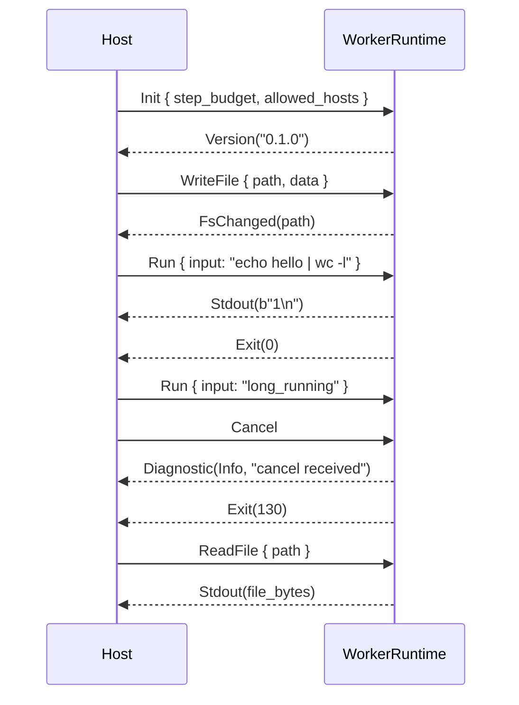

# Worker Protocol Reference

Communication protocol between the host application and the wasmsh runtime
(`WorkerRuntime`). The protocol is defined as Rust enums in the
[`wasmsh-protocol`](../../crates/wasmsh-protocol/src/lib.rs) crate and
exposed in two transports:

- **Native Rust**: enum values are passed directly into
  `WorkerRuntime::handle_command(...)` and a `Vec<WorkerEvent>` is returned.
  This is the path used by the `wasmsh-browser` (wasm-bindgen) adapter.
- **JSON over C ABI**: the `wasmsh-pyodide` adapter exposes
  `wasmsh_runtime_handle_json(handle, json_in)` which accepts a JSON-encoded
  `HostCommand` and returns a JSON-encoded `Vec<WorkerEvent>`. This is the
  path used by the npm package and any embedder talking to wasmsh through
  Pyodide.

Both transports carry the same payloads. The Rust definitions are the
canonical schema; the JSON form is `serde_json`'s default tagged
representation of those enums (see [JSON Wire Format](#json-wire-format)).

## Protocol Version

Current: `0.1.0` (`wasmsh_protocol::PROTOCOL_VERSION`).

The protocol enums are marked `#[non_exhaustive]` so embedders that match
on them must include a wildcard arm. New variants will be added as minor
versions and announced in the changelog. The major version will only bump
when an existing variant changes shape in a backwards-incompatible way.

`Init` returns the version string in a `Version` event so hosts can verify
they are talking to a compatible runtime.

## Typical Flow



A session always begins with `Init`. After that, the host may interleave
`Run`, `ReadFile`, `WriteFile`, `ListDir`, and `Cancel` calls in any order.
Sending `Run` (or any other command) before `Init` produces
`Diagnostic(Error, "runtime not initialized")`.

## Ordering and Delivery Guarantees

- Events for a given command are returned **synchronously** as a single
  `Vec<WorkerEvent>`. There is no async streaming inside one call.
- Within that vector, events appear in the order the runtime produced them:
  `Diagnostic` events for parse errors come before any execution output;
  `Stdout` and `Stderr` chunks are interleaved in production order; `Exit`
  is always the last event for `Run` calls that ran a command.
- For `WriteFile`, exactly one `FsChanged(path)` is emitted on success, or
  one `Diagnostic(Error, …)` on failure.
- For `ReadFile`, exactly one `Stdout(bytes)` is emitted on success, or one
  `Diagnostic(Error, …)` on failure.
- `Cancel` cooperatively interrupts a running command. Because the VM is
  cooperative, the in-flight `Run` call returns *its* event vector
  immediately, and the next `Run` call is unaffected.
- Sending a command variant the runtime does not recognise yields
  `Diagnostic(Warning, "unknown command")`.

## Host → Worker Commands

### `Init`

Initialise the shell runtime. Must be sent before any other command.

| Field           | Type          | Description |
|-----------------|---------------|-------------|
| `step_budget`   | `u64`         | Maximum VM steps per execution. `0` disables the budget. The VM checks the budget at instruction boundaries; runaway scripts hit the limit and exit with a diagnostic. |
| `allowed_hosts` | `Vec<String>` | Hostnames / IPs allowed for network access. Empty = no network. Patterns: exact host (`api.example.com`), wildcard (`*.example.com`), IP (`192.168.1.100`), host with port (`api.example.com:8080`). See [ADR-0021](../adr/adr-0021-network-capability.md). |

**Response**: `Version("0.1.0")`.

Calling `Init` a second time on the same runtime resets all state — VFS,
variables, functions, aliases, exec state. It is the only way to reset.

### `Run`

Execute a shell command string.

| Field   | Type     | Description |
|---------|----------|-------------|
| `input` | `String` | Shell source code. May contain multiple commands, functions, here-documents, etc. |

**Response**: zero or more `Stdout`/`Stderr`/`Diagnostic` events, terminated
by exactly one `Exit(code)`. Exit code 130 indicates cancellation; 127
indicates command-not-found; 0 is success.

### `Cancel`

Abort the currently running execution. Cooperative — actual interruption
happens at the next VM step.

**Response**: `Diagnostic(Info, "cancel received")`. The in-flight `Run`
call observes the cancellation token and returns soon after.

### `Mount`

Mount a virtual filesystem at the given path. Reserved for future
multi-backend mounts (e.g., overlay an OPFS-backed FS on a path).

| Field  | Type     | Description |
|--------|----------|-------------|
| `path` | `String` | Absolute VFS path at which to mount the filesystem |

**Response**: currently `Diagnostic(Warning, "mount not yet implemented")`.
The variant is reserved so embedders can serialise / deserialise
forward-compatible messages. To seed the VFS today, use `WriteFile`. To
swap the entire backend at compile time, enable the
`wasmsh-runtime/emscripten` feature.

### `ReadFile`

Read a file from the virtual filesystem.

| Field  | Type     | Description |
|--------|----------|-------------|
| `path` | `String` | Absolute VFS path |

**Response**: `Stdout(data)` with file contents, or `Diagnostic(Error, …)`
on failure (file not found, permission denied, etc.).

### `WriteFile`

Write data to a file in the virtual filesystem. Creates the file if it
does not exist; truncates if it does.

| Field  | Type       | Description |
|--------|------------|-------------|
| `path` | `String`   | Absolute VFS path |
| `data` | `Vec<u8>`  | File contents (raw bytes — no encoding assumptions) |

**Response**: `FsChanged(path)` on success, or `Diagnostic(Error, …)` on
failure.

### `ListDir`

List directory contents.

| Field  | Type     | Description |
|--------|----------|-------------|
| `path` | `String` | Absolute VFS directory path |

**Response**: `Stdout(bytes)` containing the entries joined by `\n`.

## Worker → Host Events

| Event                    | Fields            | Emitted by                                  | Meaning |
|--------------------------|-------------------|---------------------------------------------|---------|
| `Stdout(Vec<u8>)`        | bytes             | `Run`, `ReadFile`, `ListDir`                | Standard output / file payload bytes. |
| `Stderr(Vec<u8>)`        | bytes             | `Run`                                       | Standard error bytes (e.g. from `2>&1`, builtin error messages). |
| `Exit(i32)`              | exit code         | `Run`                                       | Final event for a `Run` call. 0 = success; 1+ = command exit; 127 = not found; 130 = cancelled. |
| `Diagnostic(level, msg)` | level + message   | any command                                 | Runtime-level message (parse errors, init errors, network denials, …). |
| `FsChanged(String)`      | path              | `WriteFile`, runtime when scripts touch FS  | Notifies the host that a VFS file changed so it can re-read or re-render. |
| `Version(String)`        | version           | `Init`                                      | Protocol version announcement. |

### Diagnostic Levels

| Level     | When emitted |
|-----------|--------------|
| `Trace`   | Verbose execution traces (currently rare; reserved for debug builds). |
| `Info`    | Informational notices (`"cancel received"`, etc.). |
| `Warning` | Non-fatal issues (`"mount not yet implemented"`, output limit approaching, unknown command). |
| `Error`   | Errors that prevented a command from running (`"runtime not initialized"`, parse errors, FS errors, JSON decode errors). |

Hosts that present diagnostics to users typically render `Error` to the
visible UI, log `Warning`, and surface `Info` and `Trace` only behind a
debug flag.

## JSON Wire Format

The Pyodide adapter (`wasmsh-pyodide`) and the npm package use a JSON
encoding of the same enums. `serde_json`'s default representation tags each
variant with its name. Field names are `snake_case`.

### Examples

`Init`:

```json
{ "Init": { "step_budget": 100000, "allowed_hosts": ["pypi.org", "*.pythonhosted.org"] } }
```

`Run`:

```json
{ "Run": { "input": "echo hello | wc -l" } }
```

`Cancel`:

```json
"Cancel"
```

`WriteFile` (note that `data` is a JSON array of byte values):

```json
{ "WriteFile": { "path": "/data/in.txt", "data": [104, 105, 10] } }
```

A response is a JSON array of events:

```json
[
  { "Stdout": [49, 10] },
  { "Exit": 0 }
]
```

`Version` and unit-style diagnostics:

```json
[ { "Version": "0.1.0" } ]
[ { "Diagnostic": ["Info", "cancel received"] } ]
```

### C ABI Surface

The Pyodide build exports four C functions
(`crates/wasmsh-pyodide/src/lib.rs`):

| Function                          | Purpose |
|-----------------------------------|---------|
| `wasmsh_runtime_new()`            | Allocate a new `WorkerRuntime` (with `python` external handler installed). Returns an opaque pointer. |
| `wasmsh_runtime_handle_json(h,p)` | Run one command. `p` is a NUL-terminated UTF-8 JSON string. Returns a NUL-terminated UTF-8 JSON string allocated by the runtime. |
| `wasmsh_runtime_free_string(p)`   | Free a string returned by `handle_json`. |
| `wasmsh_runtime_free(h)`          | Drop the runtime. |

The npm host uses `ccall` and `stringToNewUTF8` to call these functions
through the Pyodide / Emscripten module. See
`e2e/pyodide-node/tests/runtime-echo.test.mjs` for a worked example.

## See Also

- [Architecture: Execution Flow](../explanation/architecture.md#execution-flow) for what happens between `Run` and the resulting events.
- [Sandbox and Capabilities](sandbox-and-capabilities.md) for the security model behind `step_budget` and `allowed_hosts`.
- [Embedding wasmsh](../guides/embedding.md) for how to drive the protocol from a host.
- [ADR-0021](../adr/adr-0021-network-capability.md) for the network allowlist design.
