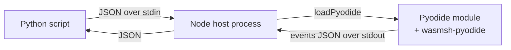

# Python Quick Start

This tutorial walks you from `pip install` to a working wasmsh sandbox in
Python. By the end you will have:

- Installed the runtime asset package and a Node.js host.
- Loaded a sandbox from Python.
- Seeded the virtual filesystem and run a shell pipeline.
- Read the result back into Python.

It takes about ten to fifteen minutes (most of which is waiting for the
first Node.js subprocess to boot Pyodide).

## Prerequisites

- **Python 3.11 or later.**
- **Node.js 20 or later.** wasmsh runs inside a Node host process; the
  Python side talks to it over a JSON-on-stdio bridge.
- **A package manager** (`pip` or `uv`).

## Architecture



The PyPI package `wasmsh-pyodide-runtime` ships the *assets* (the custom
Pyodide build with wasmsh linked in, plus a packaged Node host script). It
does not run wasmsh in-process from Python — Python invokes the Node host
as a subprocess and talks to it over JSON. The Node host is the same one
the [JavaScript quick start](javascript-quickstart.md) uses.

## Step 1: Install the package

```bash
mkdir wasmsh-quickstart
cd wasmsh-quickstart
python -m venv .venv
source .venv/bin/activate
pip install wasmsh-pyodide-runtime
```

This pulls the asset package. The Node host is bundled inside the wheel.

## Step 2: Locate the host script

The package exposes a small locator API:

```python
from wasmsh_pyodide_runtime import get_node_host_script

print(get_node_host_script())
# /path/to/.venv/lib/python3.11/site-packages/wasmsh_pyodide_runtime/assets/node-host.mjs
```

That script is the Node-side adapter that boots Pyodide and exposes a
JSON-on-stdio interface.

## Step 3: Drive it from Python

Save the following as `quickstart.py`:

```python
import json
import subprocess
from pathlib import Path

from wasmsh_pyodide_runtime import get_node_host_script


class WasmshSession:
    """Minimal Python wrapper around the wasmsh Node host."""

    def __init__(self, *, step_budget: int = 100_000, allowed_hosts: list[str] | None = None):
        self.proc = subprocess.Popen(
            ["node", str(get_node_host_script())],
            stdin=subprocess.PIPE,
            stdout=subprocess.PIPE,
            stderr=subprocess.PIPE,
            text=True,
            bufsize=1,
        )
        # The host emits a "ready" line on stdout once Pyodide is loaded.
        self._readline()
        self._send({"Init": {"step_budget": step_budget,
                             "allowed_hosts": allowed_hosts or []}})

    def _send(self, command: dict) -> list[dict]:
        assert self.proc.stdin and self.proc.stdout
        self.proc.stdin.write(json.dumps(command) + "\n")
        self.proc.stdin.flush()
        return json.loads(self._readline())

    def _readline(self) -> str:
        assert self.proc.stdout
        return self.proc.stdout.readline().strip()

    def run(self, source: str) -> dict:
        events = self._send({"Run": {"input": source}})
        return _summarise(events)

    def write_file(self, path: str, data: bytes) -> None:
        self._send({"WriteFile": {"path": path, "data": list(data)}})

    def read_file(self, path: str) -> bytes:
        events = self._send({"ReadFile": {"path": path}})
        for evt in events:
            if "Stdout" in evt:
                return bytes(evt["Stdout"])
        return b""

    def close(self) -> None:
        if self.proc.stdin:
            self.proc.stdin.close()
        self.proc.wait()


def _summarise(events: list[dict]) -> dict:
    stdout = bytearray()
    stderr = bytearray()
    exit_code = None
    for evt in events:
        if "Stdout" in evt:
            stdout.extend(evt["Stdout"])
        elif "Stderr" in evt:
            stderr.extend(evt["Stderr"])
        elif "Exit" in evt:
            exit_code = evt["Exit"]
    return {
        "stdout": stdout.decode("utf-8", "replace"),
        "stderr": stderr.decode("utf-8", "replace"),
        "exit": exit_code,
    }


if __name__ == "__main__":
    s = WasmshSession()
    try:
        # 1. Seed a CSV file inside the sandbox.
        csv = b"name,score\nalice,42\nbob,17\ncarol,99\n"
        s.write_file("/data/scores.csv", csv)

        # 2. Run a shell pipeline against it.
        result = s.run(
            "tail -n +2 /data/scores.csv | cut -d, -f2 | sort -n | tail -1"
        )
        print("highest score:", result["stdout"].strip())
        print("exit:", result["exit"])

        # 3. Run Python in the same sandbox — sees the same file.
        py = s.run(
            "python3 -c \"import csv\\n"
            "rows=list(csv.DictReader(open('/data/scores.csv')))\\n"
            "print(sum(int(r['score']) for r in rows)/len(rows))\""
        )
        print("average:", py["stdout"].strip())

        # 4. Read a file produced by the shell back into Python.
        s.run("echo 'top: carol (99)' > /data/result.txt")
        print("result file:", s.read_file("/data/result.txt").decode())
    finally:
        s.close()
```

Run it:

```bash
python quickstart.py
```

Expected output (the `average` line will have more decimal places):

```
highest score: 99
exit: 0
average: 52.666666666666664
result file: top: carol (99)
```

## What just happened

You ran shell commands and Python code inside a WebAssembly sandbox from a
Python host. Both the shell utilities and the in-sandbox Python interpreter
saw the same file (`/data/scores.csv`) because they share the same
Emscripten filesystem inside the wasm module.

The Python wrapper above is intentionally minimal. For a production
embedding you probably want:

- Robust framing (the Node host writes one JSON line per response, but
  longer payloads or trace events may need protocol extensions).
- A connection pool / process pool if you want to run many sessions.
- Cancellation handling that sends `{"Cancel": null}` from another thread.

For a higher-level Python API, see the [`langchain-wasmsh`](../../packages/python/langchain-wasmsh/)
package, which wraps this protocol with the LangChain Deep Agents
`BaseSandbox` interface.  It ships two backends:

- `WasmshSandbox()` — in-process, same single-subprocess model as this
  tutorial.
- `WasmshRemoteSandbox(dispatcher_url)` — talks HTTP to the scalable
  dispatcher + runner pool ([Helm chart](../../deploy/helm/wasmsh/))
  for Kubernetes deployments.  Same surface as the in-process variant;
  a one-line import change lets an agent scale from laptop to cluster.

See [`docs/integrations/langchain-wasmsh.md`](../integrations/langchain-wasmsh.md)
for the full guide.

## Where to go next

- [JavaScript / Node.js quick start](javascript-quickstart.md) for the
  same flow without the Python bridge — slightly faster startup and
  fewer moving parts.
- [Pyodide integration](../guides/pyodide-integration.md) for the deeper
  details of the Node host and how to install Python packages with pip.
- [Worker protocol reference](../reference/protocol.md) for the JSON
  message format the wrapper above uses.
- [Sandbox and capabilities](../reference/sandbox-and-capabilities.md) for
  what `step_budget`, `allowed_hosts`, and the other knobs do.
- [Troubleshooting](../guides/troubleshooting.md) if anything misbehaved.
